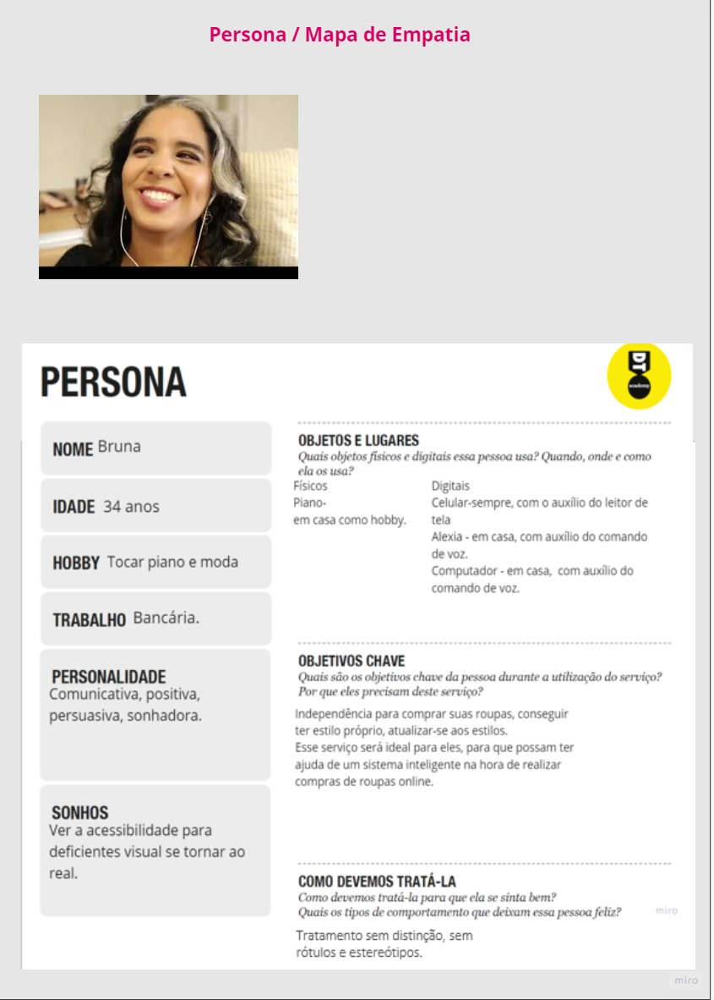
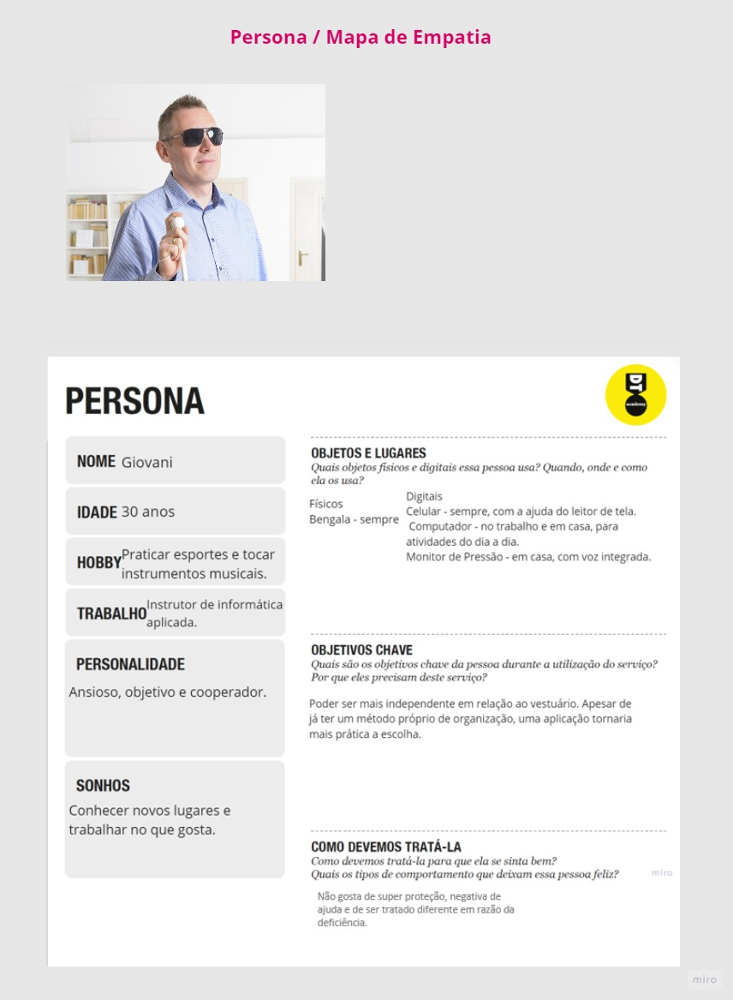
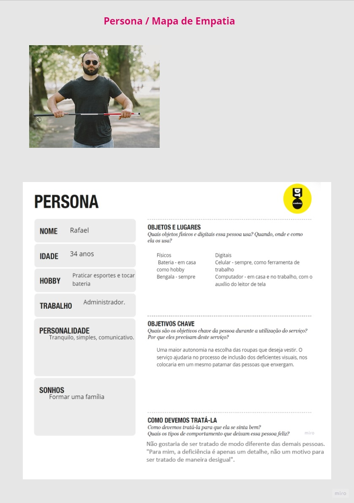

# Informações do Projeto
`TÍTULO DO PROJETO`  

Blind Outfit

`CURSO` 

Ciência da Computação

## Participantes

> Ana Cristina Martins Silva.
> 
>  Arthur Faria de Paula.
> 
> Isabella Luiza Dias dos Santos.
> 
> Franklin Inácio Santos Guimarães
> 
> Lucas Gabriel Aparecido dos Santos.
> 
> Pedro Henrique de Magalhães Honorato.

# Estrutura do Documento

- [Informações do Projeto](#informações-do-projeto)
  - [Participantes](#participantes)
- [Estrutura do Documento](#estrutura-do-documento)
- [Introdução](#introdução)
  - [Problema](#problema)
  - [Objetivos](#objetivos)
  - [Justificativa](#justificativa)
  - [Público-Alvo](#público-alvo)
- [Especificações do Projeto](#especificações-do-projeto)
  - [Personas e Mapas de Empatia](#personas-e-mapas-de-empatia)
  - [Histórias de Usuários](#histórias-de-usuários)
  - [Requisitos](#requisitos)
    - [Requisitos Funcionais](#requisitos-funcionais)
    - [Requisitos não Funcionais](#requisitos-não-funcionais)
  - [Restrições](#restrições)
- [Projeto de Interface](#projeto-de-interface)
  - [User Flow](#user-flow)
  - [Wireframes](#wireframes)
- [Metodologia](#metodologia)
  - [Divisão de Papéis](#divisão-de-papéis)
  - [Ferramentas](#ferramentas)
  - [Controle de Versão](#controle-de-versão)
- [**############## SPRINT 1 ACABA AQUI #############**](#-sprint-1-acaba-aqui-)
- [Projeto da Solução](#projeto-da-solução)
  - [Tecnologias Utilizadas](#tecnologias-utilizadas)
  - [Arquitetura da solução](#arquitetura-da-solução)
- [Avaliação da Aplicação](#avaliação-da-aplicação)
  - [Plano de Testes](#plano-de-testes)
  - [Ferramentas de Testes (Opcional)](#ferramentas-de-testes-opcional)
  - [Registros de Testes](#registros-de-testes)
- [Referências](#referências)

# Introdução

## Problema

Com o passar dos anos, a conduta do consumidor contemporâneo tem sido modificada conforme a tecnologia avança, e novas alternativas aparecem para atender a todos os tipos de perfis.

Apesar da tecnologia possibilitar uma maior interação entre consumidores e fornecedores, os deficientes visuais são uma parcela da população que ainda enfrenta barreiras no quesito acessibilidade. Em uma comunidade de consumidores que reverencia o aspecto exterior, o consumidor cego é submetido a ajuda de familiares e pessoas de sua confiança para transpassar os elementos na compatibilização da vestimenta conforme sua personalidade, segundo declarado por Schneideret. al (2017). Além disso, a privação do acesso às informações dos produtos, que disponibiliza o reconhecimento de peças de roupa, cores e padronagens, intensifica essa dependência entre deficientes visuais e terceiros.

Perante o exposto, torna-se necessária a elaboração de uma aplicação que objetiva ofertar às pessoas com deficiência visual uma autonomia na escolha de suas roupas.

## Objetivos

Diante da problemática apontada, o projeto surge como uma forma de ajudar os deficientes visuais. O Blind Outfit é um software que foi pensado com o intuito de acolher esse público, possibilitando a experiência de independência na hora da escolha de uma peça de roupa.
Assim, os objetivos principais são:
- Ajudar os deficientes a descobrirem seu estilo através de um questionário, com resultados específicos para cada personalidade.
- Descrever detalhadamente cada peça de roupa escolhida pelo usuário.

## Justificativa

Tendo como base as dificuldades das pessoas com deficiência visual em relação ao cotidiano, foi constatado pelos integrantes do grupo que uma aplicação que visa proporcionar uma autonomia ao se vestir, sobretudo oferecendo informações detalhadas acerca das características de determinado vestuário, seria de grande utilidade para esse público.

Em uma entrevista ao jornal Folha de São Paulo, o estilista Geraldo Lima, ao realizar uma coleção de inverno do ano de 2003, que tinha como inspiração a rotina dos deficientes visuais, afirmou que a maior dificuldade que os cegos enfrentam em relação à moda é a falta de informações básicas, como as cores de uma peça. Uma vez que essas informações são concedidas, os deficientes visuais adquirem uma independência na hora da escolha da roupa.  

Como exposto anteriormente, o propósito do projeto é disponibilizar um mecanismo que, a partir da detecção da descrição de dados, possibilite essa liberdade de decisão às pessoas com deficiência visual.

## Público-Alvo

  O público-alvo desse projeto abrange uma parte menor dos deficientes visuais. Sabe-se que nem todos veem a necessidade em tornar-se independentes durante a escolha da vestimenta. Isso se dá principalmente ao fato dessas pessoas já estarem acostumadas com alguém (familiares ou amigos próximos) auxiliando-as durante o processo de escolha de estilo. Assim, tem-se definido: 
- O público-alvo está entre homens e mulheres, de faixa etária dos 20 até 35 anos, já que por serem mais jovens, tendem a ser mais curiosos e abertos a mudanças em relação a este tema;
- A escolaridade varia entre ensino médio completo e superior em curso;
- Classe social entre B e C;
- Localizam-se em geral nas cidades urbanas;
- Em relação a seus hábitos: estão por dentro das tecnologias atuais, possuem a vontade de ter um estilo próprio e preferem roupas mais confortáveis.

 
# Especificações do Projeto

Nessa seção, será apresentada uma visão um pouco mais aprofundada do projeto, através da elaboração das Personas, Histórias de Usuários, Requisitos e Restrições do projeto.

## Personas e Mapas de Empatia

 Bruna tem 35 anos, é báncaria e gostaria muito de montar seu próprio estilo através de compras online.

 Giovani tem 30 anos, é instrutor de infomática aplicada e possui um desejo muito grande de comprar roupas que combinam contigo.
 
 Rafael possui 34 anos, é administrador e uns de seus desejos é ser mais independente na hora de se vestir.

>
> **Links Úteis**:
> - [Persona x Público-alvo](https://flammo.com.br/blog/persona-e-publico-alvo-qual-a-diferenca/)
> - [O que é persona?](https://resultadosdigitais.com.br/blog/persona-o-que-e/)
> - [Rock Content](https://rockcontent.com/blog/personas/)
> - [Hotmart](https://blog.hotmart.com/pt-br/como-criar-persona-negocio/)
> - [Mapa de Empatia](https://resultadosdigitais.com.br/blog/mapa-da-empatia/)
> - [Como fazer um mapa de empatia - Vídeo](https://www.youtube.com/watch?v=JlKHGpVoA2Y)
> 
> 
>**Persona**
> 
> 
> 
> 
> 
> Fonte: [Como criar uma persona para o seu negócio](https://raissaviegas.com.br/como-criar-uma-persona/)

## Histórias de Usuários

Com base na análise das personas forma identificadas as seguintes histórias de usuários:

|EU COMO... `PERSONA` | QUERO/PRECISO ... `FUNCIONALIDADE` |PARA ... `MOTIVO/VALOR`                 |
|-------------------- |------------------------------------|----------------------------------------|
|Usuário da plataforma| Conseguir comprar roupas online    | Definir estilo próprio                 |
|Usuário da plataforma| Ter acesso a lojas virtuais        | Comprar roupas que combinam comigo     | 
|Usuário da plataforma| Comprar roupas sozinho              | Ser mais independente                  |
                |                                        

## Requisitos

As tabelas que se seguem apresentam os requisitos funcionais e não funcionais que detalham o escopo do projeto.

### Requisitos Funcionais

|ID    | Descrição do Requisito                              | Prioridade |
|------|-----------------------------------------------------|------------|
|RF-001| Permitir que o usuário consiga fazer compras online |   ALTA     | 
|RF-002| Garantir um acesso prático é fácil aos usuários     |   ALTA     |

### Requisitos não Funcionais

|ID     | Descrição do Requisito  |Prioridade |
|-------|-------------------------|----|
|RNF-001| O sistema deve ser responsivo para rodar em um dispositivos móvel | MÉDIA | 
|RNF-002| Deve processar requisições do usuário em no máximo 3s |  BAIXA | 

> Com base nas Histórias de Usuário, enumere os requisitos da sua
> solução. Classifique esses requisitos em dois grupos:
>
> - [Requisitos Funcionais (RF)](https://pt.wikipedia.org/wiki/Requisito_funcional):
>   correspondem a uma funcionalidade que deve estar presente na
>   plataforma (ex: cadastro de usuário).
>
> - [Requisitos Não Funcionais (RNF)](https://pt.wikipedia.org/wiki/Requisito_n%C3%A3o_funcional):
>   correspondem a uma característica técnica, seja de usabilidade,
>   desempenho, confiabilidade, segurança ou outro (ex: suporte a
>   dispositivos iOS e Android).
>
> Lembre-se que cada requisito deve corresponder à uma e somente uma
> característica alvo da sua solução. Além disso, certifique-se de que
> todos os aspectos capturados nas Histórias de Usuário foram cobertos.
> 
> **Links Úteis**:
> 
> - [O que são Requisitos Funcionais e Requisitos Não Funcionais?](https://codificar.com.br/requisitos-funcionais-nao-funcionais/)
> - [O que são requisitos funcionais e requisitos não funcionais?](https://analisederequisitos.com.br/requisitos-funcionais-e-requisitos-nao-funcionais-o-que-sao/)

## Restrições

O projeto está restrito pelos itens apresentados na tabela a seguir.

|ID| Restrição                                             |
|--|-------------------------------------------------------|
|01| O projeto deverá ser entregue até o final do semestre |
|02| Não pode ser desenvolvido um módulo de backend        |

> Enumere as restrições à sua solução. Lembre-se de que as restrições
> geralmente limitam a solução candidata.
> 
> **Links Úteis**:
> - [O que são Requisitos Funcionais e Requisitos Não Funcionais?](https://codificar.com.br/requisitos-funcionais-nao-funcionais/)
> - [O que são requisitos funcionais e requisitos não funcionais?](https://analisederequisitos.com.br/requisitos-funcionais-e-requisitos-nao-funcionais-o-que-sao/)

# Projeto de Interface

......  COLOQUE AQUI O SEU TEXTO DE INTRODUÇÃO ......

> Apresente as principais interfaces da solução. Discuta como 
> foram elaboradas de forma a atender os requisitos funcionais, não
> funcionais e histórias de usuário abordados nas [Especificações do
> Projeto](#especificações-do-projeto).

## User Flow

## Wireframes

......  INCLUA AQUI OS WIREFRAMES DAS TELAS DA APLICAÇÃO COM UM BREVE DESCRITIVO ......

> 
> **Links Úteis**:
> - [Ferramentas de Wireframes](https://rockcontent.com/blog/wireframes/)
> - [Figma](https://www.figma.com/)
> - [Adobe XD](https://www.adobe.com/br/products/xd.html#scroll)
> - [MarvelApp](https://marvelapp.com/developers/documentation/tutorials/)
> 
> **Exemplo**:
> 
> 

# Metodologia
O projeto foi desenvolvido com base na metodologia scrum, um método de trabalho realizado a partir de pequenos ciclos de atividades dentro de um projeto. Cada ciclo de atividade é planejado previamente e se chama Sprint, composto por um período de tempo predefinido em que as tarefas devem ser realizadas pela equipe.
Foi designada a cada membro da equipe um conjunto de tarefas, objetivando uma didática mais eficaz que proporciona um abiente de desenvolvimento controlado. Com o auxílio da ferramenta "miro", foi possível desenvolver um mapa mental de desenvolvimento de todo projeto, onde pode ser consultado no seguinte link: https://miro.com/welcomeonboard/VXljSHV6UjlPR2Z2cEo0RXZsOE9pRTFERzBjdDRMZ1YwbU40ZVJuNnpCajZVUTlTc0ZaZDVBalVaZzhmbW9MNXwzNDU4NzY0NTMzOTIxMDcyNDU5fDI=?share_link_id=155739220858
 
*O processo de Design Thinking foi subdividido em 3 categorias: Entendimento, Exploração e Materialização do projeto, dentre os quais foram organizadas de maneira eficaz e otimizada.
 
-> Entendimento: Foram realizadas entrevistas qualitativas com um grupo de portadores de deficiência visual para melhor compreenção dos desafios enfrentados pelos mesmos. Mapas de stakeholders e uma matriz CSD foram criadas com a finalidade de garantir um 'feedback" do projeto.  A identificação da persona foi um dos passos mais importantes do projeto, pois apartir dela, foi possível identificar o público alvo a qual o projeto se destinará, e por tanto, garantir uma melhor experiência do usuário.
 
->Exploração: A etapa de exploração se baseia na idealização do projeto, onde foi realizado o Brainstorming, esquematizando as principais ideias e soluções. Uma vez concluído, uma votação foi feita a fim de decidir as melhores ideias. Logo, foi possível desenvolver um mapa de prioridades, onde as tarefas da equipe foram dividadas em requisitos de prioridade.
 
-> Materialização: montagem de um protótipo do projeto apartir das ideias priorizadas ( Wireframes, Fluxos de usuário, storyboards), seguida de uma linhagem rigorosa de testes afim de cumprir os requisitos da etapa de desenvolvimento. Por fim, garantir um fluxo de navegação que atenda as necessidades do usuário.
 
*Git Hub: Todos os membros da equipe possuem acesso ao repositório do projeto no git hub. Mudanças e atualizações nas etapas de desenvolvimento são constantemente atualizadas pela equipe.
 
> 
> **Links Úteis**:
> - [Tutorial Trello](https://trello.com/b/8AygzjUA/tutorial-trello)
> - [Gestão ágil de projetos com o Trello](https://www.youtube.com/watch?v=1o9BOMAKBRE)
> - [Gerência de projetos - Trello com Scrum](https://www.youtube.com/watch?v=DHLA8X_ujwo)
> - [Tutorial Slack](https://slack.com/intl/en-br/)

## Divisão de Papéis

Houveram duas divisões de papéis, uma mais geral aonde o grupo se diviu entre trabalhar na documenta do projeto ou no design. 
Já a segunda divisão ocorreu dentro de cada grupo desses, dando a cada integrante papéis mais epecíficos 

> Apresente a divisão de papéis e tarefas entre os membros do grupo.
>
> **Links Úteis**:
> - [11 Passos Essenciais para Implantar Scrum no seu Projeto](https://mindmaster.com.br/scrum-11-passos/)
> - [Scrum em 9 minutos](https://www.youtube.com/watch?v=XfvQWnRgxG0)

## Ferramentas

......  COLOQUE AQUI O SEU TEXTO - SIGA O EXEMPLO DA TABELA ABAIXO  ......

| Ambiente  | Plataforma              |Link de Acesso |
|-----------|-------------------------|---------------|
|Processo de Design Thinkgin  | Miro |   https://miro.com/welcomeonboard/VXljSHV6UjlPR2Z2cEo0RXZsOE9pRTFERzBjdDRMZ1YwbU40ZVJuNnpCajZVUTlTc0ZaZDVBalVaZzhmbW9MNXwzNDU4NzY0NTMzOTIxMDcyNDU5fDI=?share_link_id=155739220858 
|Repositório de código | GitHub | https://github.com/ICEI-PUC-Minas-PMGCC-TI/tiaw-pmg-cc-m-20222-02-acessibilidade-p-deficientes-visuais 
|Hospedagem do site | Heroku |  https://XXXXXXX.herokuapp.com | 
|Protótipo Interativo | MavelApp ou Figma | https://figma.com/XXXXXXX | 

> **Links Úteis - Hospedagem**:
> - [Getting Started with Heroku](https://devcenter.heroku.com/start)
> - [Crie seu Site com o HostGator](https://www.hostgator.com.br/como-publicar-seu-site)
> - [GoDady](https://br.godaddy.com/how-to)
> - [GitHub Pages](https://pages.github.com/)

## Controle de Versão

O projeto segue a seguinte convenção para o nome de branchs:
 
- `master`: versão estável já testada do software
- `unstable`: versão já testada do software, porém instável
- `testing`: versão em testes do software
- `dev`: versão de desenvolvimento do software
 
Quanto à gerência de issues, o projeto adota a seguinte convenção para
etiquetas:
 
- `bugfix`: uma funcionalidade encontra-se com problemas
- `enhancement`: uma funcionalidade precisa ser melhorada
- `feature`: uma nova funcionalidade precisa ser introduzida

# **############## SPRINT 1 ACABA AQUI #############**

# Projeto da Solução

......  COLOQUE AQUI O SEU TEXTO ......

## Tecnologias Utilizadas

......  COLOQUE AQUI O SEU TEXTO ......

> Descreva aqui qual(is) tecnologias você vai usar para resolver o seu
> problema, ou seja, implementar a sua solução. Liste todas as
> tecnologias envolvidas, linguagens a serem utilizadas, serviços web,
> frameworks, bibliotecas, IDEs de desenvolvimento, e ferramentas.
> Apresente também uma figura explicando como as tecnologias estão
> relacionadas ou como uma interação do usuário com o sistema vai ser
> conduzida, por onde ela passa até retornar uma resposta ao usuário.
> 
> Inclua os diagramas de User Flow, esboços criados pelo grupo
> (stoyboards), além dos protótipos de telas (wireframes). Descreva cada
> item textualmente comentando e complementando o que está apresentado
> nas imagens.

## Arquitetura da solução

......  COLOQUE AQUI O SEU TEXTO E O DIAGRAMA DE ARQUITETURA .......

> Inclua um diagrama da solução e descreva os módulos e as tecnologias
> que fazem parte da solução. Discorra sobre o diagrama.
> 
> **Exemplo do diagrama de Arquitetura**:
> 
> 

# Avaliação da Aplicação

......  COLOQUE AQUI O SEU TEXTO ......

> Apresente os cenários de testes utilizados na realização dos testes da
> sua aplicação. Escolha cenários de testes que demonstrem os requisitos
> sendo satisfeitos.

## Plano de Testes

......  COLOQUE AQUI O SEU TEXTO ......

> Enumere quais cenários de testes foram selecionados para teste. Neste
> tópico o grupo deve detalhar quais funcionalidades avaliadas, o grupo
> de usuários que foi escolhido para participar do teste e as
> ferramentas utilizadas.
> 
> **Links Úteis**:
> - [IBM - Criação e Geração de Planos de Teste](https://www.ibm.com/developerworks/br/local/rational/criacao_geracao_planos_testes_software/index.html)
> - [Práticas e Técnicas de Testes Ágeis](http://assiste.serpro.gov.br/serproagil/Apresenta/slides.pdf)
> -  [Teste de Software: Conceitos e tipos de testes](https://blog.onedaytesting.com.br/teste-de-software/)

## Ferramentas de Testes (Opcional)

......  COLOQUE AQUI O SEU TEXTO ......

> Comente sobre as ferramentas de testes utilizadas.
> 
> **Links Úteis**:
> - [Ferramentas de Test para Java Script](https://geekflare.com/javascript-unit-testing/)
> - [UX Tools](https://uxdesign.cc/ux-user-research-and-user-testing-tools-2d339d379dc7)

## Registros de Testes

......  COLOQUE AQUI O SEU TEXTO ......

> Discorra sobre os resultados do teste. Ressaltando pontos fortes e
> fracos identificados na solução. Comente como o grupo pretende atacar
> esses pontos nas próximas iterações. Apresente as falhas detectadas e
> as melhorias geradas a partir dos resultados obtidos nos testes.

# Referências

> 
> **Links Úteis**:
> - [Formato ABNT](https://www.normastecnicas.com/abnt/trabalhos-academicos/referencias/)
> - [Referências Bibliográficas da ABNT](https://comunidade.rockcontent.com/referencia-bibliografica-abnt/)
